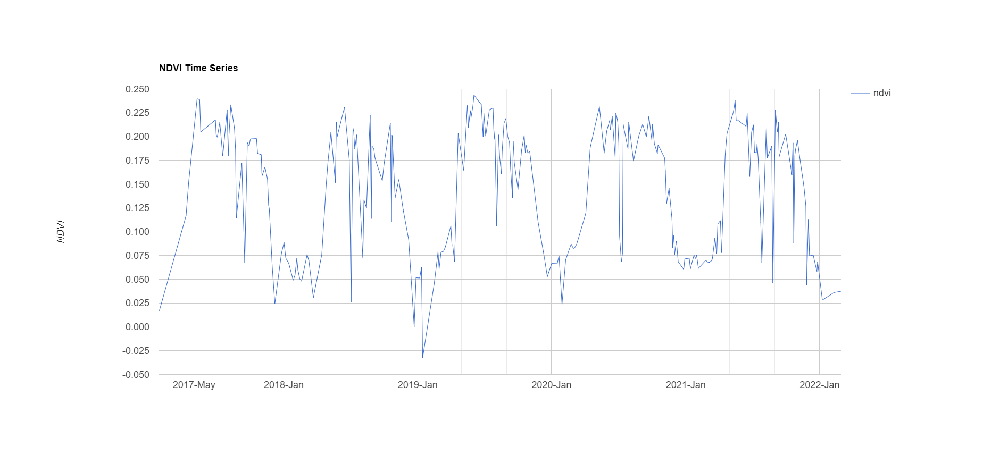

# Outlier Prediction for Land cover change

## Part 0 - Progress 

1.  Sample Data from MODIS                               
2.  Preprocessing MODIS sample data                      
3.  Better data (better resolution) extraction from GEE  
4.  Preprocessing GEE data                               
5.  Exploratory Data Analysis                            
6.  Feature Engineering for Hidden Markov Models         
7.  HMM training for NDVI change                         
8.  Outlier detection from trained HMM  
9.  Outlier Prediction for future land cover change 
10.  Hypothesis, Conclusion                

## Part 1 - Data Collection
Data was primarily extracted from MODIS Application for Extracting and Exploring Analysis Ready Samples (AρρEEARS). This Dataset with pre-computed NDVI, EVI values was used as a baseline for developing the models. 
Data with better spatial resolution was later extracted from GEE. Currently, I am preprocessing this data to fit the models.

A sample of 125 regions with 500m resolution was used with the following bands:

1. Normalized Difference Vegetation Index (NDVI)
2. Enhanced Vegetation Index (EVI)
3. Date of Year
4. MIR, NIR reflectance

## Part 2 - Data Visualization:

The NDVI values of the sample region for a specific timestep look like this:

Each region in the Image is associated with a history of values.  The 3 historic values for a sample region look like this:

I ignored the VI values because of the obvious spikes in the data. 

Each "Normal" region in the locality can be expected to have the same seasonality:

However, Outlier NDVI behaves differently. Consider region that is a "Clear outlier":

The NDVI time series shows a significant difference between a normal region and an outlier region. We want to develop a model that correctly differentiates between all the normal regions and outlier regions. Although a time series discriminative approach is more popular for this problem, I choose to differentiate the regions based on their probability distributions. In this generative approach, the behaviour of normal and outlier regions are modelled seperately, and they are differentiated with a posteriori probability.

## Part 3 - Models
### Part 3.1 - Hidden Markov Models

A hidden Markov model (HMM) is a statistical model that can be used to describe the time series of observable events that depend on hidden factors. They are powerful models which can describe the probability distributions of "Hidden States" based on the observations. 
3 Important Algorithms in HMM:
1. Forward Algorithm
2. HMM training with Expectation-Maximization: Baum–Welch algorithm
3. Maximum a posteriori estimate: viterbi (Dynamic Programming)

For our purposes, HMM can be used to differentiate between "Normal" regions and regions with outlier behaviour. a Gaussian HMM is the most applicable for our scenario, as the change of NDVI(or EVI) is expected to have a mean and a variance roughly following a Gaussian Distribution.

I created a HMM that can model the behaviour of NDVI (or EVI) changing overtime with a hope that outliers will have a different distribution compared to normal regions.  For this, we need to extract "change" over NDVI (or EVI) values. 

Visualizing NDVI change overtime for a sample region:

Fitting the regions to HMM without explicitly controlling the number of hidden states could give intuitive, but unusable results. For example, consider the opimum number of hidden states for a sample region below:

Every region would fit to a different number of hidden states because of inherent noise. However, this can be addressed with smoothing the data, or getting better data.

Post-fit visualization:

3 regions are selected based on : increasing NDVI, constant NDVI, decreasing NDVI. Each heatmap visualizes the distribution of means across the region. 
 

